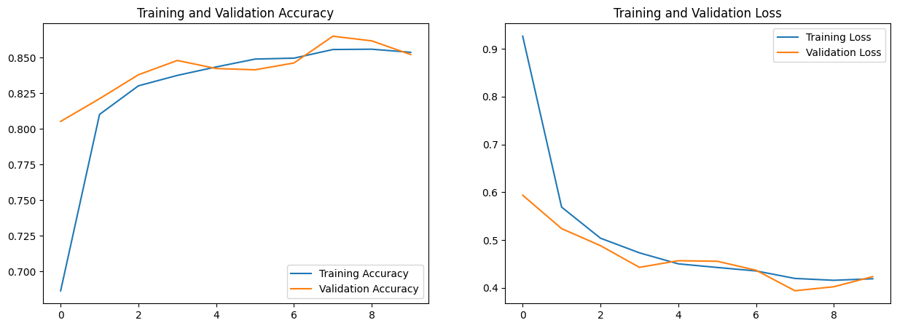
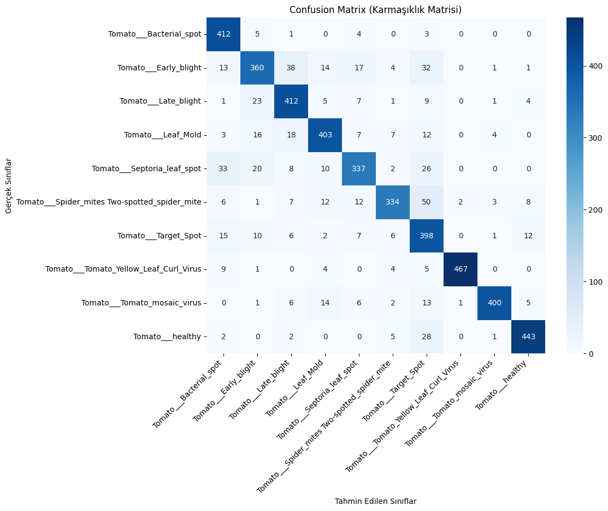

# Tomato Leaf Disease Classification using Deep Learning

## Project Overview
This project focuses on multi-class classification of tomato leaf diseases using a deep learning model.  
The system analyzes leaf images and predicts disease categories to support early detection in agriculture.

The model was trained and evaluated on a tomato leaf image dataset containing multiple disease classes and healthy samples.

---

## Objectives
- Perform multi-class image classification
- Automatically detect tomato leaf diseases
- Evaluate model performance using accuracy, loss, and confusion matrix
- Visualize training and validation performance

---

## Dataset
PlantVillage Tomato Dataset

Classes:
- Tomato Bacterial Spot
- Tomato Early Blight
- Tomato Late Blight
- Tomato Leaf Mold
- Tomato Septoria Leaf Spot
- Tomato Spider Mites
- Tomato Target Spot
- Tomato Yellow Leaf Curl Virus
- Tomato Mosaic Virus
- Tomato Healthy

---

## Technologies Used
- Python
- TensorFlow / Keras
- NumPy
- Matplotlib
- Scikit-learn

---

## Training and Validation Performance

The model shows stable convergence between training and validation accuracy and loss curves, indicating controlled overfitting and consistent learning behaviour.

---

## Confusion Matrix

The confusion matrix illustrates class-wise prediction performance and highlights areas where misclassification occurs between visually similar diseases.

---

## Model Performance Summary
- Validation Accuracy: approximately 85%
- Stable training process
- Low divergence between training and validation curves
- Strong performance across most disease categories

---

## How to Run

Clone repository:
